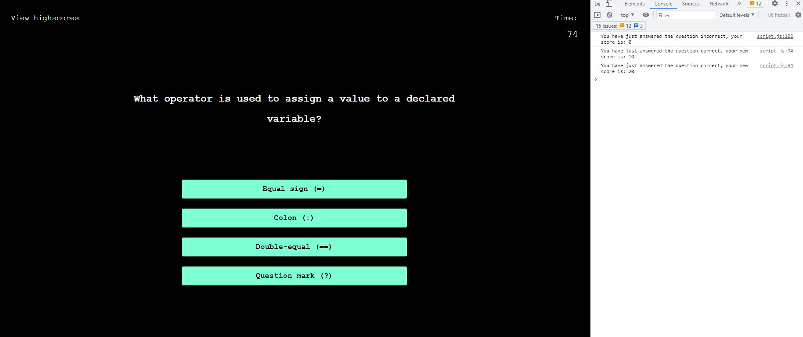

# <Ultimate Coding Quiz>

## Description

I created this project to make a learning experience interactive and fun. On this project you are able to play a quick quiz game and record your score and test your knowledge in coding. The best thing I learnt from this was the power of Javascript and its abilities. I struggled a lot trying to write Javascript functions but learnt to write up elements dynamically through Jasvascript.

## Usage

Here you can see a mini clip of how the site functions, on "Start Quiz" a timer is started and the questions shall loop through to the next question as you select your answers.

    
    

Console Log Features step by step comments to interact with page actions and scores.

## Credits

ADL Uni Bootcamp,

2U Tutors,

Youtube.com,

mdn web docs.

## License

MIT License

Please see LICENSE for details